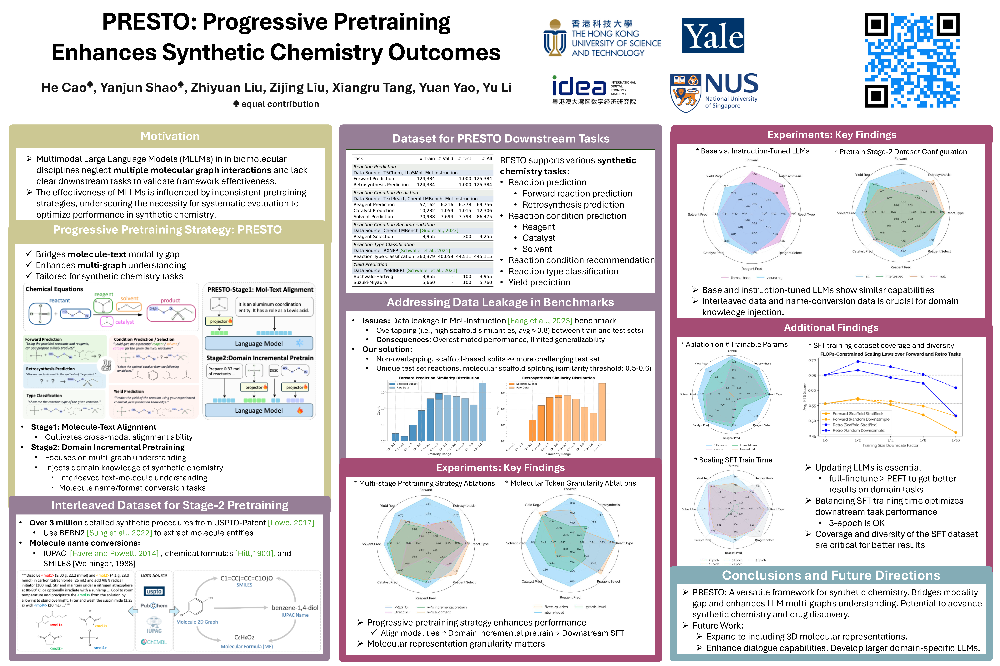
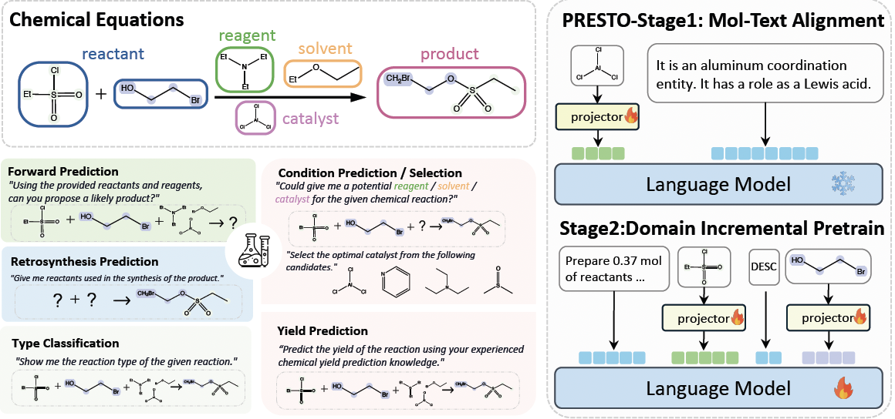

# PRESTO: Progressive Pretraining Enhances Synthetic Chemistry Outcomes (EMNLP 2024 Findings)

[](https://github.com/tatsu-lab/stanford_alpaca/blob/main/LICENSE)
[](https://github.com/tatsu-lab/stanford_alpaca/blob/main/DATA_LICENSE)
[](https://arxiv.org/abs/2406.13193)
[](https://github.com/IDEA-XL/PRESTO)
[](https://huggingface.co/OpenMol)
[](https://github.com/IDEA-XL/PRESTO/network/members)
[](https://github.com/IDEA-XL/PRESTO/stargazers)
[](https://github.com/IDEA-XL/PRESTO/graphs/contributors)
[](https://aclanthology.org/2024.findings-emnlp.597/)

**PRESTO** (Progressive Pretraining Enhances Synthetic Chemistry Outcomes) is a framework for pretraining and fine-tuning large language models (LLMs) for various tasks in synthetic chemistry.



## Release
- [2024/11/14] 🏖️ Presented our paper at EMNLP 2024, Miami. [[Poster](assets/poster.pptx)]
- [2024/09/20] 🔥 Paper accepted by EMNLP 2024.
- [2024/06/19] 🔥 We first release our code (including training and evaluation scripts).


**Usage and License Notices**: The data, code and checkpoint is intended and licensed for research use only. They are also restricted to uses that follow the license agreement of LLaMA, Vicuna, LLaVA, Mol-Instructions. The dataset is CC BY NC 4.0 (allowing only non-commercial use) and models trained using the dataset should not be used outside of research purposes.



## Installation

1. Install the required dependencies:
   ```
   conda create -n presto python=3.10
   pip install -r requirements.txt
   pip install -e .
   ```

2. Set up the necessary environment variables:
   ```
   export MOLECULE_2D_PATH="/path/to/MoleculeSTM/"
   export WANDB_API_KEY="your_wandb_api_key"
   ```

## Pretraining

### Stage 1: Molecule-Text Alignment

To perform Stage 1 pretraining for molecule-text alignment, run the following command:
```bash
bash scripts/pretrain_multi_molecule/stage1.sh
```

This script will pre-train the model using the PubChem caption dataset and save the pretrained model checkpoints.

### Stage 2: Domain Incremental Pretraining

For Stage 2 pretraining, there are several configurations available:

- `stage2.sh`: Pretraining using interleaved molecule-text data from USPTO-Application.
- `stage2_rxn_nc.sh`: Pretraining using interleaved reaction data and name conversion tasks (g2s, s(g)2i, s(g)2f).
- `stage2_all.sh`: Pretraining using interleaved reaction data and all name conversion tasks (i2s, i2f).
- `stage2_skip_align.sh`: Skipping Stage 1 and directly starting with Stage 2 pretraining, only training the projector.
- `stage2_skip_align_fulltune.sh`: Skipping Stage 1 and directly starting with Stage 2 pretraining, finetuning the entire model.

To run a specific Stage 2 pretraining configuration, execute the corresponding script. For example:
```bash
bash scripts/pretrain_multi_molecule/stage2_rxn_nc.sh
```

## SFT (Stage 3) Downstream Tasks

For Stage 3 finetuning, we include finetuning scripts for various downstream tasks. Each task has its own directory under `scripts/build_dataset/` to build the dataset and `scripts/sft/` to run the finetuning. There are several configurations available:

- `stage3_freezeLLM.sh`: Finetuning the projector with a frozen LLM on Stage 3 downstream tasks.
- `stage3_lora.sh`: Finetuning the projector and applying LoRA to train the LLM on Stage 3 downstream tasks.
- `stage3_rxn_nc.sh`: Finetuning the LLM (pretrained using `stage2_rxn_nc.sh`) on Stage 3 downstream tasks.
- `stage3_skip_align_fulltune.sh`: Skipping Stage 1 and training with the full model on Stage 2 pretraining data and Stage 3 downstream tasks.
- `stage3_skip_stage2.sh`: Skipping Stage 2 and training with the full model on Stage 1 pretraining data and Stage 3 downstream tasks.
- `stage3_skip_stage12.sh`: Skipping Stage 1 and 2 and training with the full model on Stage 3 downstream tasks.
- `stage3.sh`: Train with the full model on Stage 3 directly.

To run a specific Stage 3 finetuning configuration, execute the corresponding script. For example:
```bash
bash scripts/sft/sft_lora/stage3_rxn_nc.sh $EPOCH $MODEL_VERSION
# $EPOCH: the epoch number to finetune the model (e.g., 3)
# $MODEL_VERSION: the model version to finetune (e.g., SFT-ALL)
```

## Evaluation

Here is a list of all the downstream tasks and the corresponding commands to run the evaluation:

### Reaction Prediction
#### Forward Prediction

To evaluate the forward reaction prediction task, use the following commands:

```bash
# For lora model
bash scripts/evaluate/sft_lora/evaluate_forward_reaction_prediction.sh $EPOCH $MODEL_VERSION

# For full model
bash scripts/evaluate/sft_full/evaluate_forward_reaction_prediction.sh $EPOCH $MODEL_VERSION
```

#### Retrosynthesis Prediction

To evaluate the retrosynthesis prediction task, use the following command:
```bash
# For lora model
bash scripts/evaluate/sft_lora/evaluate_retrosynthesis.sh $EPOCH $MODEL_VERSION

# For full model
bash scripts/evaluate/sft_full/evaluate_retrosynthesis.sh $EPOCH $MODEL_VERSION
```

### Reaction Condition Prediction
#### Reagent Prediction
To evaluate the reagent prediction task, use the following commands:

```bash
# For lora model
bash scripts/evaluate/sft_lora/evaluate_reagent_prediction.sh $EPOCH $MODEL_VERSION

# For full model
bash scripts/evaluate/sft_full/evaluate_reagent_prediction.sh $EPOCH $MODEL_VERSION
```

#### Catalyst Prediction
To evaluate the catalyst prediction task, use the following commands:

```bash
# For lora model
bash scripts/evaluate/sft_lora/evaluate_catalyst_prediction.sh $EPOCH $MODEL_VERSION

# For full model
bash scripts/evaluate/sft_full/evaluate_catalyst_prediction.sh $EPOCH $MODEL_VERSION
```

#### Solvent Prediction
To evaluate the solvent prediction task, use the following commands:

```bash
# For lora model
bash scripts/evaluate/sft_lora/evaluate_solvent_prediction.sh $EPOCH $MODEL_VERSION

# For full model
bash scripts/evaluate/sft_full/evaluate_solvent_prediction.sh $EPOCH $MODEL_VERSION
```

### Reaction Condition Recommendation  
#### Reagent Selection
To evaluate the reagent selection task, use the following commands:

```bash
# For lora model
bash scripts/evaluate/sft_lora/evaluate_reagent_selection.sh $EPOCH $MODEL_VERSION

# For full model
bash scripts/evaluate/sft_full/evaluate_reagent_selection.sh $EPOCH $MODEL_VERSION
```

### Reaction Type Classification
To evaluate the reaction type classification task, use the following commands:

```bash
# For lora model
bash scripts/evaluate/sft_lora/evaluate_reaction_classification.sh $EPOCH $MODEL_VERSION

# For full model
bash scripts/evaluate/sft_full/evaluate_reaction_classification.sh $EPOCH $MODEL_VERSION
```

### Yield Prediction
To evaluate the yield prediction task, use the following commands:

```bash
# For lora model
bash scripts/evaluate/sft_lora/evaluate_yields_regression.sh $EPOCH $MODEL_VERSION

# For full model
bash scripts/evaluate/sft_full/evaluate_yields_regression.sh $EPOCH $MODEL_VERSION
```

## Model Serving

To serve the trained model using a Flask server, run:

```
python scripts/serve_model.py --model_name_or_path <path_to_model> --model_lora_path <path_to_lora_model> --port <port_number>
```

This will start a Flask server that exposes a `/generate` endpoint for generating predictions using the trained model.

## Dataset Preparation

The `scripts/build_dataset` directory contains scripts for preparing datasets for different tasks. To prepare the datasets, follow the instructions within each task-specific directory.

- NOTE: Huggingface Dataset under preparation. Once the dataset is ready, we will sync the readme.


## License

This project is licensed under the Apache License 2.0. See the [LICENSE](LICENSE) file for more information.

## Acknowledgments

This project builds upon the work of various open-source libraries and frameworks, and we would like to acknowledge their contributions.
- [multi_token](https://github.com/sshh12/multi_token): We mostly built upon this implementation to support multi-token molecules.
- [Hugging Face Transformers](https://github.com/huggingface/transformers)
- [LLaVA](https://github.com/haotian-liu/LLaVA)
- [VILA](https://github.com/Efficient-Large-Model/VILA)

- We also thank the researchers and developers whose ideas and implementations have inspired and guided this project.

For more details and advanced usage, please refer to the documentation and source code.


## Citation
If you find PRESTO useful for your research and applications, please cite using this BibTeX:
```bibtex
@inproceedings{cao-etal-2024-presto,
    title     = {{PRESTO}: Progressive Pretraining Enhances Synthetic Chemistry Outcomes},
    author    = {Cao, He and Shao, Yanjun and Liu, Zhiyuan and Liu, Zijing and Tang, Xiangru and Yao, Yuan and Li, Yu},
    editor    = {Al-Onaizan, Yaser and Bansal, Mohit and Chen, Yun-Nung},
    booktitle = {Findings of the Association for Computational Linguistics: EMNLP 2024},
    month     = nov,
    year      = {2024},
    address   = {Miami, Florida, USA},
    publisher = {Association for Computational Linguistics},
    url       = {https://aclanthology.org/2024.findings-emnlp.597},
    pages     = {10197--10224}
}

```
